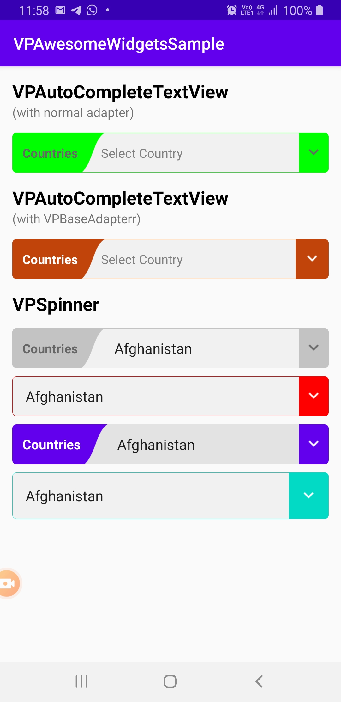

# VPAwesomeWidgets
Awesome Spinner and Awesome AutoCompleteTextView. Fully customized and easy to use

[](https://opensource.org/licenses/Apache-2.0) [](https://github.com/gomods/athens)

Currently this library includes following Awesome Widgets.
* VPAutoCompleteTextView
* VPSpinner

### Demo
<p float="left">
  
  
</p>

## Getting Started

### Install
```gradle
dependencies {
   implementation 'awesome.vrund.vpawesomewidgets:VPAwesomeWidgets:1.0.3'
}
```

### VPAutoCompleteTextView
<b>-> Features :</b>
* Awesome UI.
* Display all items on drop button click.
* Customze beautiful filter

Add `VPAutoCompleteTextView` in your XML file.

```XML
<awesome.vrund.vpawesomewidgets.VPAutoCompleteTextView
    android:id="@+id/vpDrop"
    android:layout_width="match_parent"
    android:layout_marginTop="15dp"
    android:layout_height="56dp"
    app:act_hasLabel="true"
    app:act_hint="Select Country"
    app:act_labelText="Countries" />
```

Interface definition for a callback to be invoked when item clicked on popup.

```Kotlin
vpDrop.itemClickListener = object : VPAutoCompleteTextView.OnItemClickListener {
    override fun onItemClick(view: VPAutoCompleteTextView, position: Int) {
        Log.e("TAG", view.getAdapter()!!.getItem(position).toString())
    }
}
 ```
 <b>Attributes:</b>
 
| Attributes | Type | Default | Description |
|------------|------|---------|-------------|
| act_backColor | color | #f1f1f1 | sets background color of widget |
| act_hasBorder | boolean | true | sets border visivility of widget |
| act_hasLabel | boolean | true | sets label visibility of widget |
| act_labelText | string | null | sets lebel text of widget |
| act_labelTextSize | dimension | 14sp | sets lebel text size of widget |
| act_labelTextColor | color | #666666 | sets label text color of widget |
| act_dropSize | dimension | 36dp | sets dropdown width of widget |
| act_dropIcon | reference | vp_drop_icon | sets dropdown icon of widget |
| act_dropIconTint | color | #666666 | sets dropdown icon color of widget |
| act_tint | color | #c3c3c3 | sets tint color of widget |
| act_hint | String | null | sets hint of widget |
| act_text | String | null | sets text of widget |
| act_hintColor | color | default | sets hint color of widget |
| act_textColor | color | default | sets text color of widget |
| act_textSize | dimension | 14sp | sets text size of widget |
| act_textStyle | enum <sub></br> bold = 1</br> italic = 2</br> normal = 0</sub>| normal | sets text style of widget |

### VPSpinner
<b>-> Features :</b>
* Awesome UI.

Add `VPSpinner` in your XML file.

```XML
<awesome.vrund.vpawesomewidgets.VPAutoCompleteTextView
    android:id="@+id/vpSpinner"
    android:layout_width="match_parent"
    android:layout_height="56dp"
    app:sp_hasLabel="false"
    app:sp_labelText="Countries" />
```

Interface definition for a callback to be invoked when selected item on the spinner popup.

```Kotlin
vpSpinner.itemSelectedListener = object : VPSpinner.OnItemSelectedListener {
    override fun onItemSelected(view: VPSpinner, selectedItem: Any?, position: Int) {
        Log.e("TAG", selectedItem.toString())
    }
}
 ```
 <b>Attributes:</b>
 
| Attributes | Type | Default | Description |
|------------|------|---------|-------------|
| sp_backColor | color | #f1f1f1 | sets background color of widget |
| sp_hasBorder | boolean | true | sets border visivility of widget |
| sp_hasLabel | boolean | true | sets label visibility of widget |
| sp_labelText | string | null | sets lebel text of widget |
| sp_labelTextSize | dimension | 14sp | sets lebel text size of widget |
| sp_labelTextColor | color | #666666 | sets label text color of widget |
| sp_dropSize | dimension | 36dp | sets dropdown width of widget |
| sp_dropIcon | reference | vp_drop_icon | sets dropdown icon of widget |
| sp_dropIconTint | color | #666666 | sets dropdown icon color of widget |
| sp_tint | color | #c3c3c3 | sets tint color of widget |

### VPBaseAdapter

Default adapter dosen't work when you apply space in `AutoCompleteTextView`. `VPBaseAdapter` comes in best with this issue

<b>-> Features</b>
* Search with sapce included
* Highlight search query in dropdown
* Works with both `HashMap<String, String>` & `Object`

<b>Use with `HashMap<String, String>`</b>
```Kotlin
val countries = ArrayList<HashMap<String, String>>()

val adp = VPBaseAdapter(context, countries)
adp.setFilterTag("YOUR KEY") \\ THIS IS TO BE USED FOR FILTER
vpDrop.setAdapter(adp)
```

setting `setFilterTag("YOUR KEY")` will filter data according to that key value from hash map. if you will not set it, will automitacally fetch first key from keyMap.

<b>Use with `Object`</b>
```Kotlin
val countries = ArrayList<Object>()

val adp = VPBaseAdapter(context, countries)
vpDrop.setAdapter(adp)
```

override `toString()` in Model class with parameter you want to filter
```Kotlin
override fun toString(): String {
    return name
}
```

## Developed By
* Vrund Purohit - vrund14@gmail.com

## Licence

```
Copyright 2020 Vrund Purohit

Licensed under the Apache License, Version 2.0 (the "License");
you may not use this file except in compliance with the License.
You may obtain a copy of the License at

   http://www.apache.org/licenses/LICENSE-2.0

Unless required by applicable law or agreed to in writing, software
distributed under the License is distributed on an "AS IS" BASIS,
WITHOUT WARRANTIES OR CONDITIONS OF ANY KIND, either express or implied.
See the License for the specific language governing permissions and
limitations under the License.

```
